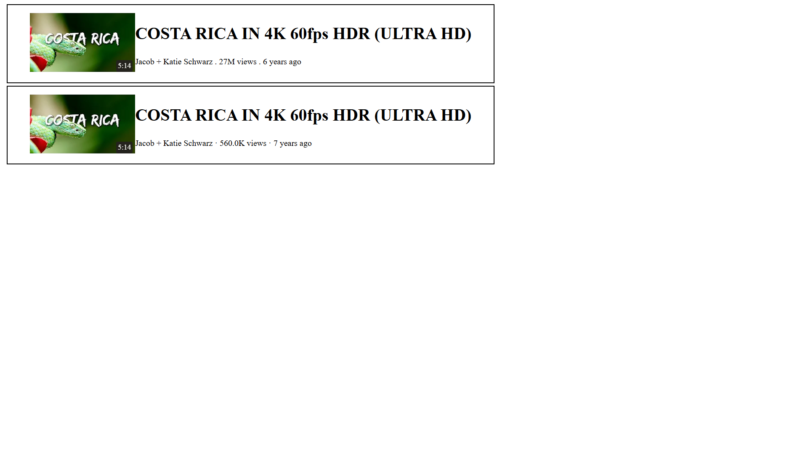

# Dynamic Website Builder

This project is a simple dynamic website builder that creates a video card displaying video details such as the title, channel name, views, upload time, and duration. The project includes HTML, CSS, and JavaScript code to create and style the video cards dynamically.

## Features

- Dynamically create and display video cards
- Responsive and modern design
- Easy to use and extend

## Technologies Used

- HTML
- CSS
- JavaScript

## Getting Started

### Prerequisites

Make sure you have a web browser installed.

### Installation

1. Clone the repository or download the ZIP file.
2. Open `index.html` in your web browser.

### Usage

You can create a new video card by calling the `createCard` function in the `script.js` file. The function takes the following parameters:

- `title` (string): The title of the video.
- `cName` (string): The channel name.
- `views` (number): The number of views.
- `monthsOld` (number): The number of years since the video was uploaded.
- `duration` (string): The duration of the video.
- `thumbnail` (string): The URL of the thumbnail image.

Example usage:
```javascript
createCard(
    "COSTA RICA IN 4K 60fps HDR (ULTRA HD)",
    "Jacob + Katie Schwarz",
    560000,
    7,
    "5:14",
    "https://i.ytimg.com/vi/LXb3EKWsInQ/hqdefault.jpg?sqp=-oaymwEcCNACELwBSFXyq4qpAw4IARUAAIhCGAFwAcABBg==&rs=AOn4CLD4wSJfkfvSUtiCctwlo7thMOlAiw"
);
```

## Project Structure
```
├── index.html
├── style.css
└── script.js
```

## Screenshot



## License
This project is licensed under the MIT License - see the LICENSE file for details.

## Acknowledgements
Inspired by various dynamic website projects.